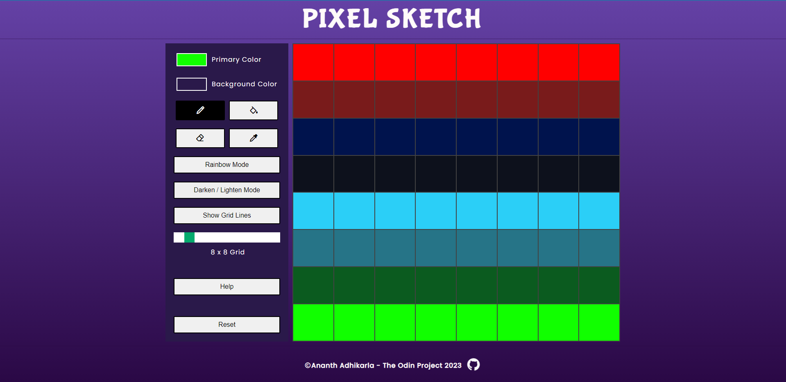

# Pixel Sketch - Easy to use pixel editor

- Primary Color: Your default pen color
- Background Color: Your default background color
- Pen Mode: Click on each square or click and move your mouse to color it
- Color Bucket Mode: Fills all the squares with the selected color
- Eraser Mode: Click on each square or click and move your mouse to erase it
- Eye Droper Mode: Click on a square to pick up that color as your default color
- Rainbow Mode: Generates random color for each click
- Darken/Lighten Mode: Click on each square or click and move your mouse to color it. Left Click to LIGHTEN and Right Click to DARKEN
- Show Grid Lines: Toggles grid lines on and off
- Slider: Pick your canvas size from 1 x 1 grid to 64 x 64 grid
- Reset: Clears the canvas back to original
- Have fun!!!

# 
[Click here to try it live...](https://ananth-adhikarla.github.io/PixelSketch/)
#

